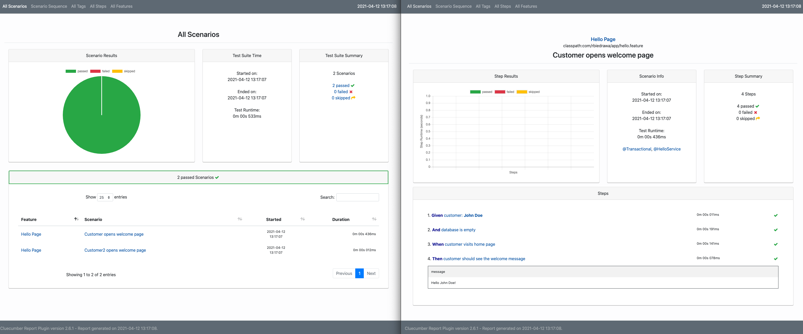

# Acceptance tests with Spring Boot, Cucumber and Junit5 (demo) 

This sample application is intended to show the `acceptance testing` approach using [Cucumber](https://cucumber.io/docs/installation/java/) and [Junit5](https://junit.org/junit5/).



## Features

* `Junit5` integration.
* Separate acceptanceTest `test set`.
* `Cucumber` integration.
* Custom Cucumber hook for `@Transactional` rollback.
* `Cluecumber Report plugin` integration for beautiful html reports.

## Getting Started

### Prerequisite

* Java 11

### Usage

* Run **acceptance tests**.
  ```shell
  ./gradlew acceptanceTest
  ```

* Generate **html reports**.
  ```shell
  ./gradlew generateCluecumberReports
  ```
  *** *report will be generated under:* `build/reports/acceptanceTest/index.html`.


* Run tests based on **tag**.
  ```shell
  ./gradlew acceptanceTest -Dcucumber.filter.tags="@Slow"
  ```

* Use **@Disabled** to ignore cucumber test.

## References

* [Cucumber](https://cucumber.io/)
* [Junit5](https://junit.org/junit5/)  
* [Cluecumber Report Gradle Plugin](https://github.com/JavaanseHZ/cluecumber-report-gradle-plugin)
* [Cluecumber Report Maven Plugin](https://github.com/trivago/cluecumber-report-plugin)

## License

Distributed under the MIT License. See `LICENSE` for more information.
